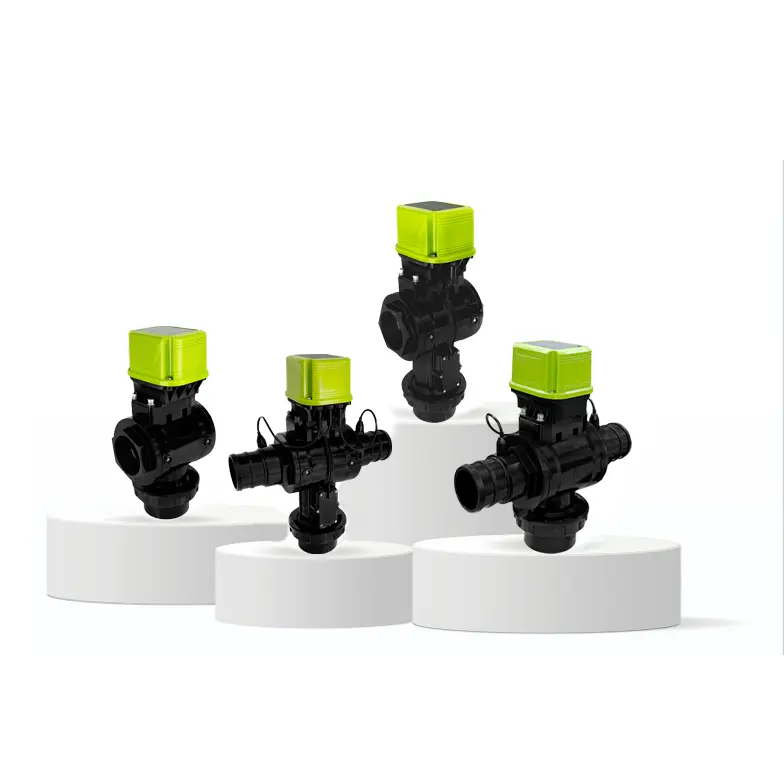

# 强泰自控智慧灌溉知识库

---
插入图片示例：

## 公司介绍

强泰自控深耕智能灌溉领域14年，是中国智能灌溉阀门领导者，更是中国高新技术企业。自2012年入局赛道、2017年落户深圳科创高地，历经五次技术迭代，手握35项核心专利，行业权威认证加持，硬核实力领跑赛道。目前业务覆盖全国及海外40多个国家，全球服务超3000+规模化农业主体，灌溉覆盖农田超1000万亩，客户满意度高达90%，用实战成果筑牢行业口碑。

---

## 文档导航

### 用户手册

| 文档 | 说明 |
|------|------|
| [快速开始](快速开始/快速开始.md) | 快速入门指南 |
| [快速安装&验证](快速开始/快速安装&验证.md) | 安装配置手册 |
| [高级功能](快速开始/高级功能.md) | 高级功能使用指南 |

### 产品类别

| 文档                        | 说明                     |
| ------------------------- | ---------------------- |
| [产品概览](产品类别/产品类别.md)      | 产品系列介绍                 |
| [阀门产品](产品类别/阀门产品.md)      | 阀门类产品（08, 05/12, 30系列） |
| [DTU控制器](产品类别/DTU产品.md)   | DTU控制器产品               |
| [DTU传感器](产品类别/DTU-传感器.md) | DTU传感器模块               |
| [DTU水泵控制](产品类别/DTU-水泵.md) | DTU水泵控制                |
| [LoraWAN网关](LoraWAN网关.md) | LoraWAN网关              |

### 通信方式

| 文档 | 说明 |
|------|------|
| [通信方式概览](通信方式/通信方式.md) | 通信方式介绍 |
| [4G通讯协议](通信方式/4G通讯协议.md) | 4G模块通讯协议 |
| [LoRaWAN协议](通信方式/LoRaWAN协议.md) | LoRaWAN协议规范与网关配置 |
| [RS485协议](通信方式/RS485协议.md) | RS485协议规范（部分产品支持） |
| [蓝牙通讯协议](通信方式/蓝牙通讯协议.md) | 蓝牙通信协议（部分产品支持） |

### 系统对接

| 文档 | 说明 |
|------|------|
| [系统对接概览](系统对接/系统对接.md) | 系统对接方式介绍与选型 |
| [平台对接](系统对接/平台对接.md) | 客户平台对接强泰云平台 |
| [设备直连](系统对接/设备直连.md) | 设备直连客户MQTT Broker |

### 故障排查

| 文档 | 说明 |
|------|------|
| [故障排查手册](故障排查/故障排查手册.md) | 故障排查总览 |
| [产品硬件问题](故障排查/产品硬件问题.md) | 硬件相关故障排查 |
| [软件功能问题](故障排查/软件功能问题.md) | 软件功能故障排查 |
| [常规故障排查](故障排查/常规故障排查.md) | 常规故障排查流程 |

### 技术支持

| 文档 | 说明 |
|------|------|
| [技术支持](技术支持/技术支持.md) | 技术支持联系方式 |

---

**提示**：点击上方链接可跳转到对应文档。如需特定功能或问题的详细信息，请查阅相关章节。
